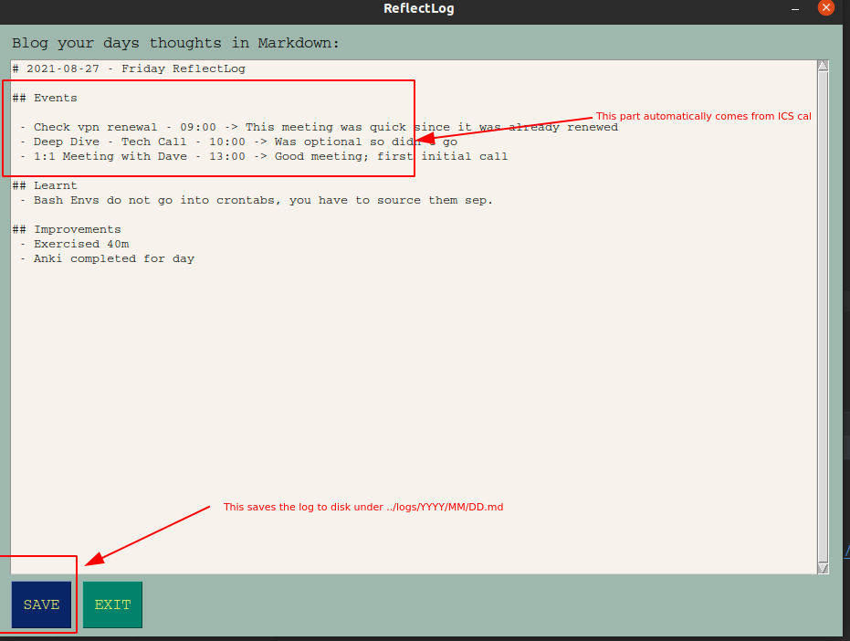

# PyReflectLog

Objectives: the plan is to build a useful tool quickly in an afternoon in python. Single python script self-contained that will run on a crontab at 6pm M-F 
and auto commit to github for backup purposes at 10pm.

## Overview



### 5hr Feature List:
 - [ ] Run continuously in Systray with a custom icon (raised [ticket](https://github.com/moses-palmer/pystray/issues/98) pystray seems to not work on my linux)
 - [x] It should read ICS cal entries that should form the basis for the day's log
 - [x] Able to take the days work logs notes in some kind of GUI
 - [x] A popup should appear at ~6pm to prompt log
 - [x] File notes in private github project under: <yyyy>/mm/dd.md - (should be auto committed at 10pm?)


### Setup
 1. Save your ICS URL in `~/.ics`:
 ```text
export ICS=https://your-domain.com/your/calendar.ics
```
 2. Git clone repo: `git clone git@github.com:robmsmt/ReflectLog.git`
 3. cd to reflectlog: `cd ReflectLog/reflectlog`
 4. Make a private repo on github and update remote url (IMPORTANT: ENSURE ITS SET TO PRIVATE) with: `./0_update_private_urls.sh`
 5. Run: `1_install_venv.sh`
 6. Run: `2_install_crontabs.sh`
 7. Every day 18:30 M-F you will get a GUI asking you to daily log with hints from your CAL. At 22:00 it will commit it if you have not already done so.

## Future & Issues
Some ideas I had that might be nice for the future but I won't do:
 - Link to Anki stats to get doing/done/outstanding cards
 - Link to Garmin step count / exercise info
 - Food cals / motivations / inspirations / quote of the day
 - PySimplyGUI multiline text can't ctrl+z or move around as nicely as normal UI... e.g. ctrl+del doesn't delete whole word
